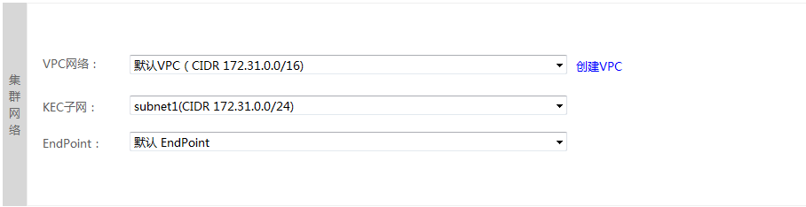

## 创建集群-高级选项-安全与访问

　　1.设置集群网络

　　KMR服务依赖VPC（虚拟专有网络）以及子网、EndPoind等组件，在创建KMR集群时，会创建默认VPC和相关组件。如需创建自定义VPC，请点击“创建VPC”,参考金山云VPC产品相关文档，或者咨询技术支持。
  
  
  
| 字段 | 操作 |
| -- | -- |
| **VPC网络** | 您可以使用默认VPC来创建KMR集群，也可以选择自定义VPC |
| **KEC子网** | KEC子网是VPC中用于管理云主机的网络单元，您可以使用默认KEC子网，也可以选择自定义子网。如果使用自定义VPC，请确认VPC中已创建可用的KEC子网 |
| **EndPoint** | EndPoint可以在您的VPC和其他KSC服务之间创建私有连接，使用KMR服务必须指定EndPoint. 如果使用自定义VPC，请确认VPC中已创建可用的EndPoint|

　　2.设置集群管理信息