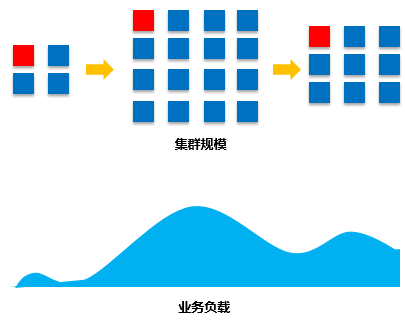
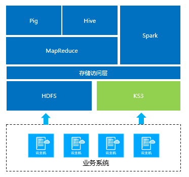

## 产品功能

　　KMR提供了丰富的管理功能和便捷的程序开发接口，使您可以高效自动化的进行数据处理和分析工作，节省管理成本和使用成本：
  
　　**弹性扩展**
  
  
　　
  KMR集群具备良好的横向扩展能力，您可以根据业务需求弹性的增加或者减少节点，适应多变的业务场景，节省集群使用成本。
  
　　**标准存储服务（KS3）访问**
  
  
  
　　KMR可以通过内部高速网络直接访问标准存储服务（KS3），在进行数据处理工作时，您可以首先把原始数据汇总到KS3。KMR集群中运行的MapReduce、Hive、Pig、Spark等作业可以直接调用KS3中存储的这些数据进行计算，并把结果写回到KS3。KS3提供了较低使用成本和极高的数据可靠性，并保证在集群释放时仍然可以持久的存储原始数据和计算结果。
  
　**　集群模板管理**
 
　　集群模板记录了创建一个集群所需的配置信息以及集群中需要运行作业的配置信息，模板功能帮助您快速创建一个特定配置的KMR集群，或者完成一组作业，您可以新建或通过已有集群来生成模板。
  
　　**集群执行计划**
  
  
  
  
  