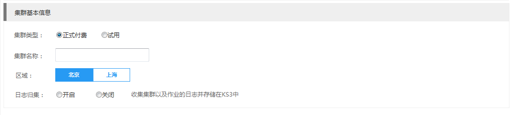

## 创建集群

* **创建集群-快速选项**

　　我们提供了快速选项帮助您快速完成KMR集群创建，如需要更多的配置项，请切换到创建集群-高级选项

　　KMR的某些功能依赖于KS3，在创建集群之前，请确认您已经开通KMR和KS3服务，并已经创建AccessKey/SecretKey 参阅KS3官方文档 [创建密钥](http://www.ksyun.com/doc/art/id/612)

　　如需使用KS3存放原始数据，参阅[数据导入到KS3]()。

　　打开金山云控制台，选择KMR服务，选择“集群管理”，点击“创建集群”，默认快速选项，进入集群配置页面
  
　　1.填写集群的基本信息

 
| 字段| 操作|
| -- | -- |
| 付费类型 | 选择集群付费类型，有“按量付费”、“包年包月”和“免费试用”三种类型， 您可以联系商务来申请KMR集群试用，“试用”集群会在试用期结束后自动释放集群，请您注意及时转正续费。|
| 集群名称 | 创建集群时，会根据系统时间戳帮您创建一个默认名称。您也可以为KMR集群输入描述性名称。该名称不必是唯一的。 |
| 选择区域 | 选择KMR集群所在区域。（如果需要使用KS3存储数据，应确保KMR与KS3处于同一区域） |
| 日志归集 | 日志归集功能可以把集群和作业的日志统一存放在KS3的指定目录中，便于管理和持久保存。该选项默认关闭，开启该选项后需要选择日志在KS3上的存放目录，或在弹出的对话框中新建目录 |
| 日志路径 | 您可以键入或浏览用于存储 KMR 日志的KS3 存储桶（bucket），例如 ks3://myemrbucket/logs，也可以让KMR为您生成一个KS3 路径。如果键入的文件夹名称在存储桶中不存在，系统将为您创建该文件夹。各种集群服务和作业的日志在KS3上对应的路径结构，请参考附录3 KMR日志归集路径 |

　　2.选择集群的软件配置