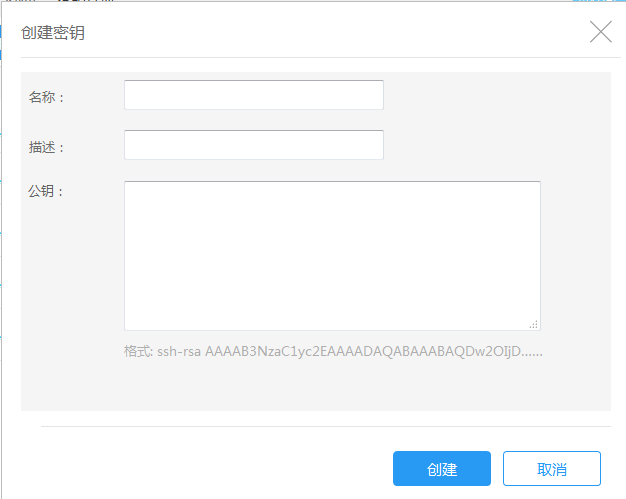

## 创建密钥

打开金山云控制台，选择KMR服务，选择“密钥管理”，点击“创建密钥”，进入创建密钥页面

| 字段 | 操作 |
| -- | -- |
| **名称** | 您可以为密钥输入描述性名称 |
| **描述** | 输入对该密钥的描述语言 |
| **公钥** | 输入用密钥生成工具生成的公钥，格式形如“ssh-rsaAAAAB3NzaC1yc2EAAAABJQAAAQEAxljLUF//ygzu1Dy/sArs1hpoN……”详情见 [为集群添加SSH密钥](tian_jia_ssh_mi_yao.md) |
