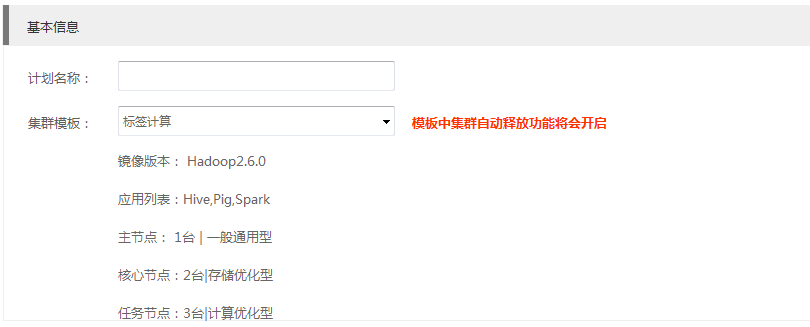
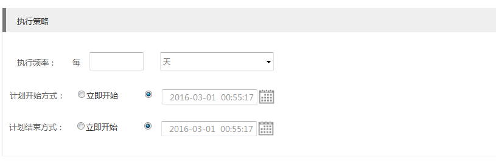

## 创建执行计划

打开金山云控制台，选择KMR服务，选择“执行计划”，点击“创建计划”，进入创建计划页面
1.填写计划基本信息

| 字段 | 操作 |
| -- | -- |
| **计划名称** | 您可以为执行计划输入描述性名称 |
| **集群模板** | 选择执行计划所依托的集群模板，下方显示该模板基本配置信息 *注意，所选的模板集群释放功能会自动开启* |

2.填写计划执行策略

| 字段 | 操作 |
| -- | -- |
| **执行频率** | 您可以指定执行计划的执行频率，选择周期执行或者一次性执行 |
| **计划开始方式** | 选择执行计划的开始方式，您可以立即开始，也可以指定未来日期作为开始时间 | 
| **计划结束方式** | 选择执行计划所依托的集群模板，下方显示该模板基本配置信息 *注意，所选的模板集群释放功能会自动开启* |