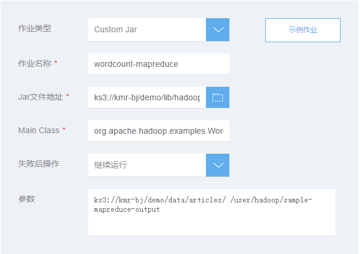

## 添加Custom JAR作业

　　您可以编写 Java 应用程序，生成 JAR 文件，然后将 JAR 文件上传到集群本地HDFS或者KS3中来处理数据。当执行此操作时，JAR 文件必须包含适用于 Map-Reduce 功能的实现。
  
　　1.在KMR集群创建时或者创建完成后打开添加作业页面，前置步骤请参考　[创建集群-快速选项](chuang_jian_ji_qun_kuai_su_xuan_xiang.md)、[创建集群-高级选项](chuang_jian_ji_qun_gao_ji_xuan_xiang.md) 和　[查看作业](zuo_ye_xiang_qing.md)

　　2.在添加作业页面填写作业信息，点击确定提交：

 | 字段 | 操作 |
| -- | -- |
| **作业类型** | 选择需要执行的作业类型，这里请选择Custom Jar |
| **作业名称** | 输入作业名称，长度最多25个字符 |
| **JAR文件地址** | 输入JAR包的存储路径，如使用KS3存储它们，该路径的形式为： **ks3://BucketName/path/jar**|
| **MainClass** | 指定主程序的类名 |
| **失败后操作** | 当作业执行失败后，集群可以根据这里的设置自动执行一些操作  继续：作业执行失败后，继续执行下一个作业。 取消作业并等待：作业执行失败后，取消集群中已提交的作业，集群进入等待状态，直到提交下一个作业。 销毁集群：作业运行失败后，销毁集群。 该选项的结果不会受到“集群释放保护”功能影响 | 
| **参数** | 选择KMR集群中需要安装的Hadoop周边生态应用。*注意，在集群创建完成后这些选项无法更改* |

　　3.如果您是在创建集群阶段添加作业，点击“下一步”，跳转到确认订单页面，提交订单后，添加的作业会在集群创建完成后开始执行。

　　4.如果您是对已创建的集群添加作业，作业提交后立即开始执行。