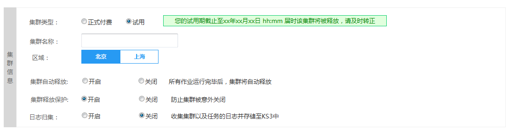
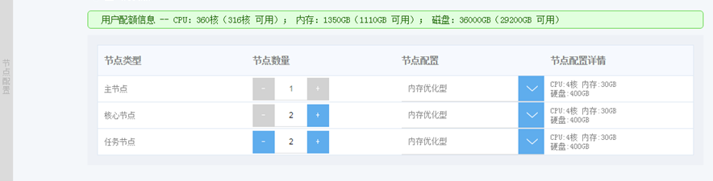
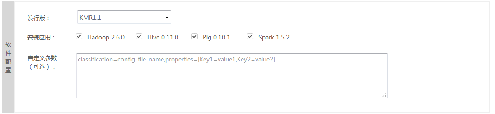

## 集群基本信息

　　1.填写集群的基本信息

| 字段 | 操作 |
| -- | -- |
| **集群类型** | 选择集群付费类型，有“按量付费”、“包年包月”和“免费试用”三种类型， 您可以联系商务来申请KMR集群试用，“试用”集群会在试用期结束后自动释放集群，请您注意及时转正续费。 |
| **集群名称** | 选择集群付费类型，有“按量付费”、“包年包月”和“免费试用”三种类型[原型应添加相关逻辑]， 您可以联系商务来申请KMR集群试用，“试用”集群会在试用期结束后自动释放集群，请您注意及时转正续费。 |
| **选择区域** | 选择KMR集群所在区域。（如果需要使用KS3存储数据，应确保KMR与KS3处于同一区域） |
| **集群自动释放** | 默认情况下，该选项处于关闭状态。集群自动释放开启时，当集群中最后一个作业执行完毕会自动释放集群。**如果需要KMR集群持久运行，或者需要使用HDFS持久存储数据，请确保关闭该选项。**该选项在集群创建完成后不可修改。 |
| **集群释放保护** | 集群保护可确保KMR集群中的云主机实例不会因为意外事故或者错误而被释放。如果集群中包含的数据位于节点实例存储中，而您又必须在这些实例释放前予以恢复，那么这种保护尤其有用。该选项默认开启。该选项**不会影响“集群自动释放”功能** |
| **日志归集** | 日志归集功能可以把集群和作业的日志统一存放在KS3的指定目录中，便于管理和持久保存。该选项默认关闭，开启该选项后需要选择日志在KS3上的存放目录，或在弹出的对话框中新建目录 |
| **日志路径** |您可以键入或浏览用于存储 KMR 日志的KS3 存储桶（bucket），例如 ks3://myemrbucket/logs，也可以让KMR为您生成一个KS3 路径。如果键入的文件夹名称在存储桶中不存在，系统将为您创建该文件夹。 各种集群服务和作业的日志在KS3上对应的路径结构，请参考 [KMR日志归集路径](kmrri_zhi_gui_ji_lu_jing.md) |

　　2.配置集群节点

| 字段 | 操作 |
| -- | -- |
| **用户配额** | 开通KMR服务时，会为每个账户分配一个资源配额，如果账户中使用的集群资源超过了该配额，则无法创建集群。如有特殊需求，请联系您的客户经理 |
| **主节点** | 主要用于集群管理，并将计算程序和原始数据集分配到核心实例。此外，它还会跟踪每个计算作业的执行状态，监控实例的运行状况。KMR主节点与Hadoop系统的主节点相对应。一个KMR集群只有一个主节点。 |
| **核心节点** | 主要用于执行各项集群计算作业，同时作为hadoop分布式文件系统的数据节点存储数据。KMR核心节点与Hadoop系统的slave节点相对应。一个KMR集群可以有2至多个核心节点 |
| **任务节点** | 只用于执行各项集群计算作业,不作为分布式文件系统(HDFS)的数据存储节点，一个KMR集群可以有0至多个任务节点 |
| **节点配置** | 可根据实际的业务需求选择集群节点数量和类型，详见 [KMR产品定价与选购](chan_pin_ding_jia_yu_xuan_gou.md) |

　　3.选择集群的软件配置

