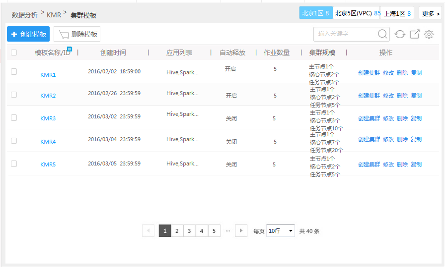

## 集群模板列表

　　模板创建完成后可以在模板列表中查看模板的基本信息，并对模板进行简单操作，模板列表会根据创建时间来排序。
  
  

**模板筛选：**您可以通过搜索模板名称，快速定位到所找的模板。
**创建集群：**您可以通过模板列表末尾的“创建集群”超链接来创建集群
**修改模板：**您可以通过集群列表末尾的“修改”超链接来修改模板配置信息
**删除模板：**您可以通过集群列表末尾的“删除”超链接来删除模板，也可以在左侧勾选多个集群，然后选择“删除模板”来批量删除
**复制模板：**您可以通过集群列表末尾的“复制”超链接来复制特定配置的集群模板
**模板详情：**单击集群列表模板名称来进入模板详情页面，请参考 集群模板详情

