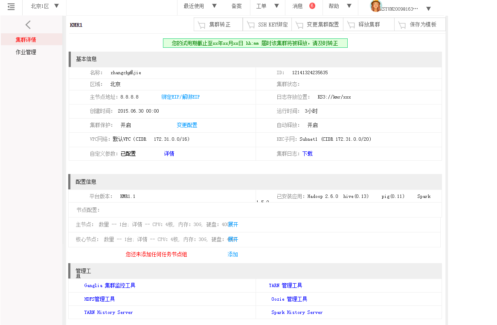

## 集群详情

　　集群详情页面列出的集群的基本信息，您可以对一些集群配置进行更改

绑定/解绑EIP：可以通过绑定EIP来获取公网地址访问主节点，如果已绑定EIP，也可以解绑EIP。
集群保护：释放保护功能保障集群不会因为意外错误导致销毁，您可以点击超链接来更改状态。
自定义参数：显示集群自定义参数的配置信息，点击“详情”超链接可以查看具体的参数配置信息
集群日志：点击“下载”超链接，可以下载集群的具体日志信息
配置信息：列出了平台版本、已安装应用和集群节点的硬件配置信息，点击“展开”超链接，可以看到节点ID，状态，IP地址等更多信息。
管理工具：Hadoop和Spark等应用具有丰富的原生管理工具，点击各个工具链接，能够直接进入管理界面，进行相关管理和查询。用户通过此接口进入管理工具界面，无需使用SSH Tunnel方式进入。管理工具包括ResourceManager、NameNode、JobHistory、Ganglia、Oozie和Spark，请参考3.7监控指南
集群转正：测试集群在测试期结束后会自动释放，如需继续使用，请点击页面上方“集群转正”按钮，可以将试用集群转为正式集群，即刻计费[转正的按钮交互是否可以更直观一些？]
SSH KEY绑定：点击该按钮，可以为集群绑定SSH密钥，请参考3.4.1为集群添加SSH密钥
变更节点配置：点击该按钮，您可以根据需求来增加或者减少核心节点和任务节点的数量。
注意：变更核心节点，尤其是减少核心节点的操作在某些极特殊情况下可能会导致HDFS文件系统数据不可用，请您操作前注意，或咨询技术支持。
释放集群：点击该按钮，会弹出释放集群对话框。释放集群将会删除掉所有集群节点、HDFS上存储的数据以及正在运行的作业且无法恢复，KS3上面存储的数据将会保留,请慎重操作。释放集群之前请确认“集群释放保护”选项处于关闭状态
保存为模板：点击该按钮，可以将该集群保存为模板