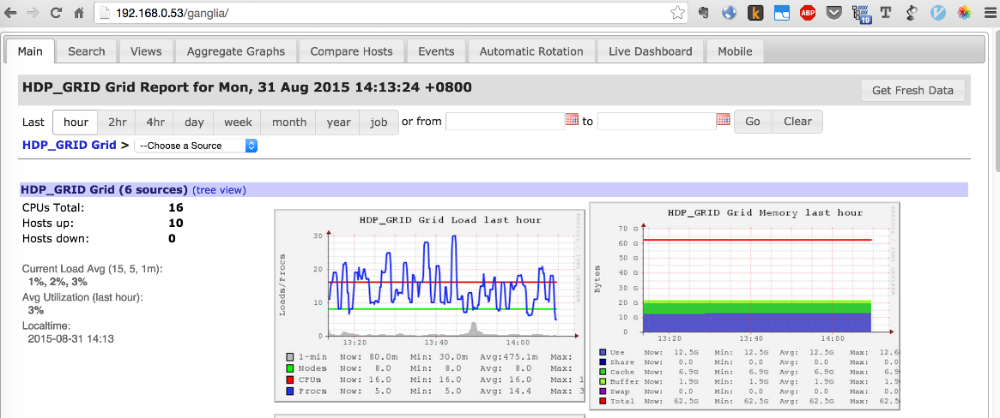

## 监控指南

Hadoop各服务组件都具备了完善的原生监控功能，除此之外，我们还在KMR中集成了Ganglia监控工具，用户可以通过“集群详情”-“管理工具”-“Ganglia”进入

1.使用Ganglia监控集群状态

Ganglia是UC Berkeley发起的一个开源集群监视项目，设计用于测量数以千计的集群节点，主要用来监控系统性能，如：CPU 、内存和硬盘利用率， I/O负载、网络流量情况等，通过曲线很直观的了解到每个节点的工作状态，对合理调整、分配系统资源，提高系统整体性能起到重要作用。

在KMR中，我们为您在集群中集成了Ganglia服务，您可通过“集群详情”-“管理工具”-“Ganglia”直接进入

Ganglia服务页面如下图所示：

2.Hadoop服务状态查看

安装在 KMR集群上的 Hadoop 和其他应用程序会将用户界面发布在主节点上托管的网站，这些页面记录了各类集群服务的统计和监控信息，你可以直接通过“集群详情”-“管理工具”进入各个页面查看。

