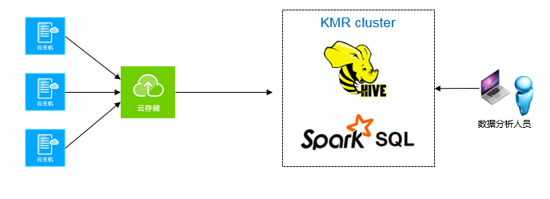

##使用场景

　　**离线数据处理**
  
　　离线数据处理是最常见的Hadoop应用场景，您可将原始数据上传到KS3或者集群HDFS文件系统中，通过控制台或者API来执行批量的离线处理作业。
  
  
  
　　**既席数据分析**
  
　　即席查询是指用户在使用系统时，可以根据自己当时的需求定义的查询。KMR提供了Hive和SparkSQL等类SQL查询方案，您可使用简单直观的查询方法对海量的数据进行探索和分析。
  
  
  
  
  

  

