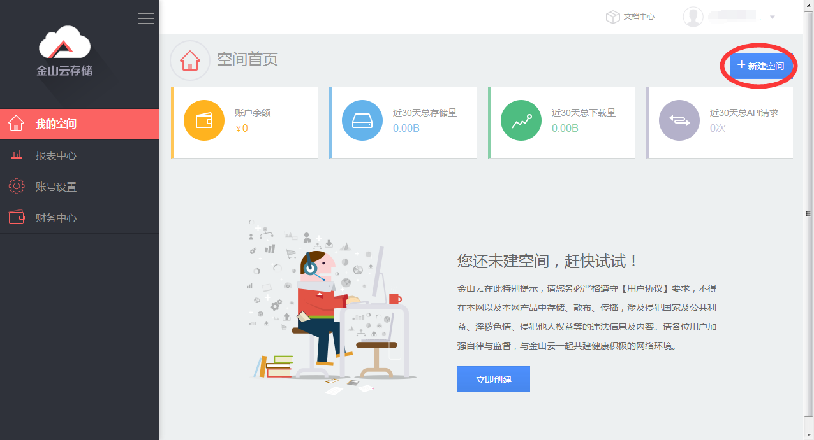
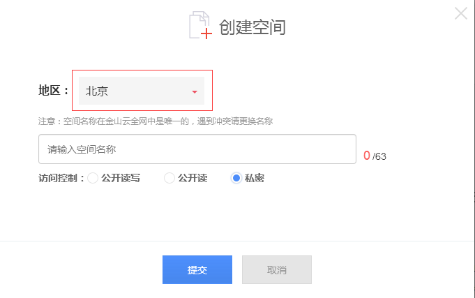
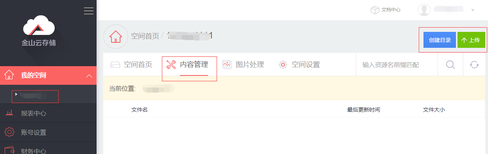

## 数据导入指南

　**　1. 数据导入到KS3**

　　KMR集群可以直接访问标准存储服务KS3，在开始使用KMR之前，我们建议您开通KS3服务，把计算程序和原始数据集中到KS3中便于管理和持久化保存。
  
　　（1）进入KS3控制台，新建存储空间 http://ks3.ksyun.com/console.html#/
  
  
  
　　（2）“地区”选择“中国（北京）”（目前KMR仅在北京region提供），输入空间名称，如无需公开读写，访问控制选择“私密”即可。
  
  
  
  
  
　　（3）进入空间，选择“内容管理”，可以创建目录，或者直接通过浏览器上传文件，超过500M以上的文件可以使用SDK或者工具上传
  
　　KS3 SDK:     https://github.com/ks3sd<br>
　　KS3上传工具 http://www.ksyun.com/doc/art/id/432
  
  
  
  
　　**2. 数据导入到HDFS**

　　通常情况下，KMR需要处理的原始数据直接存放在KS3上，即可完成各种计算作业。为了获得更好的数据处理性能，充分发挥Hadoop数据本地化的优势，我们可以把数据从KS3拷贝到KMR集群的HDFS文件系统中。
  
　　DistCp（分布式拷贝）是用于大规模集群内部和集群之间拷贝的工具。 它使用Map/Reduce实现文件分发，错误处理和恢复，以及报告生成。金山云KMR采用特殊的技术处理，您可以使用DistCp工具直接在HDFS和KS3间拷贝数据。
  
　　操作步骤:
  
　　1.通过SSH连接到主节点，请参考3.7 SSH连接指南<br>
　　2.输入命令： su hadoop 切换到hadoop用户<br>
　　3.执行以下格式命令：hadoop distcp <源路径>  <目标路径><br>
　　示例：
  
　**　HDFS上传到KS3**
 
```
　　hadoop distcp /user/hadoop/conf/hive-site.xml ks3://testbarcket/kmr/
```

　　**KS3拷贝到HDFS**
  
```
　　hadoop distcp ks3://testbarcket/kmr/hive-site.xml /user/hadoop/conf/
```
 


Discp的更多用法请参考 DisCp Guide
  