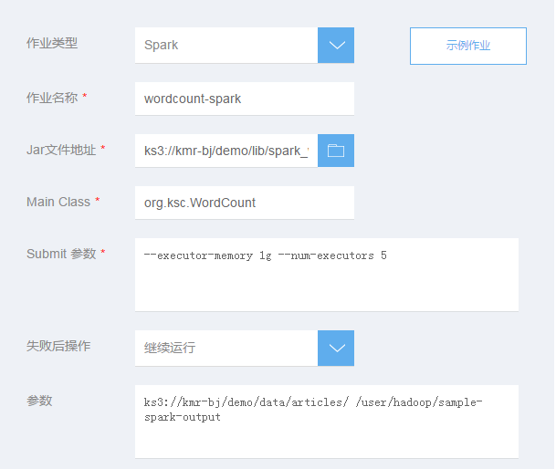

## 添加Spark作业

　　Spark是一种类Hadoop MapReduce的通用并行框架，Spark拥有Hadoop MapReduce所具有的优点，同时具有SQL查询，流式计算，集群学习等模块，得到了广泛的认可。KMR集成了最新版本的Spark，可用来构建大型的、低延迟的数据分析应用。
  
　　*注意：Spark默认不会安装在KMR集群中，需要在集群创建时勾选，否则无法运行Spark类型作业。*
  
　　1.在KMR集群创建时或者创建完成后打开添加作业页面，前置步骤请参考　[创建集群-快速选项](chuang_jian_ji_qun_kuai_su_xuan_xiang.md)、[创建集群-高级选项](chuang_jian_ji_qun_gao_ji_xuan_xiang.md) 和　[查看作业](zuo_ye_xiang_qing.md)

　　2.在添加作业页面填写作业信息，点击确定提交：

 | 字段 | 操作 |
| -- | -- |
| **作业类型** | 选择需要执行的作业类型，这里请选择Spark |
| **作业名称** | 输入作业名称，长度最多25个字符 |
| **Jar文件地址** | 输入Spark应用程序的存储路径，如使用KS3存储它们，该路径值的形式应该是 **ks3://BucketName/path/SparkJar**|
| **MainClass** | 指定主程序的类名|
| **Spark-submit选项** | 输入spark-submit选项 详情请参考 https://spark.apache.org/docs/1.5.2/submitting-applications.html|
| **失败后操作** | 当作业执行失败后，集群可以根据这里的设置自动执行一些操作  **继续：**作业执行失败后，继续执行下一个作业。 **取消作业并等待：**作业执行失败后，取消集群中已提交的作业，集群进入等待状态，直到提交下一个作业。 **销毁集群：**作业运行失败后，销毁集群。 该选项的结果不会受到“集群释放保护”功能影响 | 
| **参数** | 参数：输入以下指定的参数进行相关的配置：-D key=value指定配置，-p KEY=VALUE指定变量，也可加入自定义参数。输入参数时，只需要输入参数本身字符串即可，用空格分隔，无需参数转义和url encode。|

　　3.如果您是在创建集群阶段添加作业，点击“下一步”，跳转到确认订单页面，提交订单后，添加的作业会在集群创建完成后开始执行。

　　4.如果您是对已创建的集群添加作业，作业提交后立即开始执行。