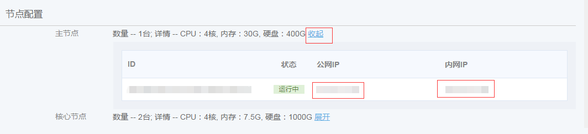
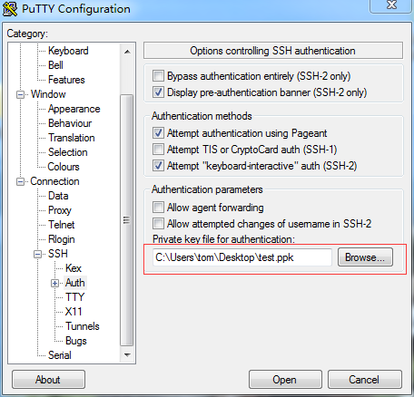
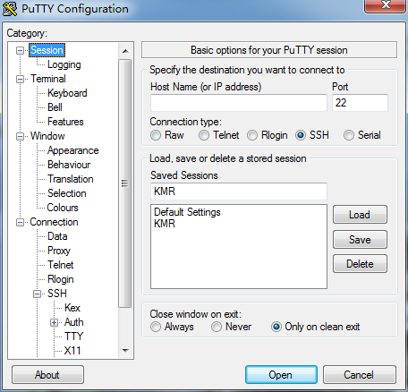

## 使用SSH访问集群

　　1.打开KMR控制台，进入集群详情，展开主节点的详细信息，您可以通过公网（如果绑定EIP）或者内网IP地址访问集群。

　　2.导入[为集群添加SSH密钥](tian_jia_ssh_mi_yao.md) 中产生的私钥

　　windows用户可以使用PuTTY.exe工具
　　http://www.chiark.greenend.org.uk/~sgtatham/putty/download.html
  
　　3.指定IP和端口连接KMR主节点，连接到集群，登陆账户名是root。

　　主节点和核心节点已配置了SSH互信，可以在控制台查看核心节点的IP地址，直接从主节点登陆到各个核心节点。