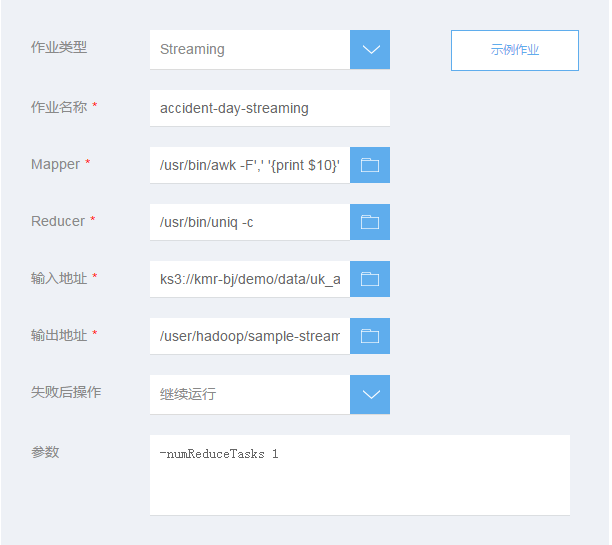

## 添加Custom JAR作业

　　Hadoop Streaming 是 Hadoop 附带的一种实用功能，可让您使用非 Java 语言开发 MapReduce 可执行文件。您可以在控制台上创建streaming作业，也可以像运行标准 JAR 文件一样，通过KMR API来运行它。
  
　　有关hadoop streaming，请参考 
　　http://hadoop.apache.org/docs/r2.6.0/hadoop-mapreduce-client/hadoop-mapreduce-client-core/HadoopStreaming.html
  
　　1.在KMR集群创建时或者创建完成后打开添加作业页面，前置步骤请参考　[创建集群-快速选项](chuang_jian_ji_qun_kuai_su_xuan_xiang.md)、[创建集群-高级选项](chuang_jian_ji_qun_gao_ji_xuan_xiang.md) 和　[查看作业](zuo_ye_xiang_qing.md)

　　2.在添加作业页面填写作业信息，点击确定提交：

 | 字段 | 操作 |
| -- | -- |
| **作业类型** | 选择需要执行的作业类型，这里请选择Streaming |
| **作业名称** | 输入作业名称，长度最多25个字符 |
| **Mapper地址** | 输入 Map任务可执行命令或脚本的存储路径，如使用KS3存储它们，该路径值的形式应该是： **ks3://BucketName/path/MaperExecutable**|
| **Reducer地址** | 输入 Reduce任务可执行文件或脚本的存储路径，如使用KS3存储它们，该路径值的形式应该是： **ks3://BucketName/path/ReducerExecutable** |
| **输入地址** | 指定原始数据的存放位置，这个地址必须已经存在，并且您有权限读取这个地址的文件。 |
| **输出地址** |指定计算结果存放位置，这个地址必须是不存在的，并且您有权限对这个地址进行写操作，否则作业运行会失败。 |
| **失败后操作** | 当作业执行失败后，集群可以根据这里的设置自动执行一些操作  **继续：**作业执行失败后，继续执行下一个作业。 **取消作业并等待：**作业执行失败后，取消集群中已提交的作业，集群进入等待状态，直到提交下一个作业。 **销毁集群：**作业运行失败后，销毁集群。 该选项的结果不会受到“集群释放保护”功能影响 | 
| **参数** | 您可以为作业输入一些参数，这些参数会不做任何修改的传给MainClass中的main函数。输入参数时，只需要输入参数本身字符串即可，用空格分隔，无需参数转义和url encode。 |

　　3.如果您是在创建集群阶段添加作业，点击“下一步”，跳转到确认订单页面，提交订单后，添加的作业会在集群创建完成后开始执行。

　　4.如果您是对已创建的集群添加作业，作业提交后立即开始执行。