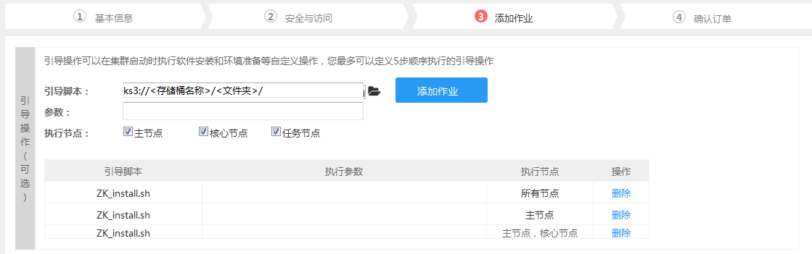
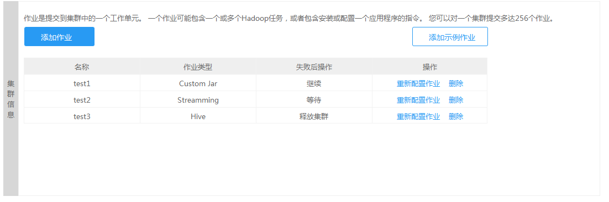

##创建集群-高级选项-添加作业

　　1.设置引导操作

　　自定义引导操作是一个可选的高级选项，可以在集群启动时执行软件安装和环境准备等自定义操作，大多数情况下无需配置。
  
  
  
| 字段 | 操作 |
| -- | -- |
| **引导脚本** | 加入引导脚本可以在集群启动时执行软件安装和环境准备等自定义操作，最多可定义5个顺序执行的引导操作。如使用KS3存储它们，该路径值的形式应该是： ks3://BucketName/path/MaperExecutable |
| **参数** | 通过输入参数来自定义引导脚本参数配置 |
| **执行节点** |勾选执行引导操作的节点，有主节点、核心节点和任务节点三种节点可选|
| **添加脚本** |完成输入引导脚本地址、配置参数和选择执行节点后，点击“添加脚本“，新增的脚本就会按照添加时间顺序显示在下方|
| **删除脚本** | 您可以点击“删除脚本”超链接，就会删除对应的脚本|

　　2.设置作业信息

| 字段 | 操作 |
| -- | -- |
| **引导脚本** | 加入引导脚本可以在集群启动时执行软件安装和环境准备等自定义操作，最多可定义5个顺序执行的引导操作。如使用KS3存储它们，该路径值的形式应该是： ks3://BucketName/path/MaperExecutable |
| **参数** | 通过输入参数来自定义引导脚本参数配置 |
| **执行节点** |勾选执行引导操作的节点，有主节点、核心节点和任务节点三种节点可选|
| **添加脚本** |完成输入引导脚本地址、配置参数和选择执行节点后，点击“添加脚本“，新增的脚本就会按照添加时间顺序显示在下方|
| **删除脚本** | 您可以点击“删除脚本”超链接，就会删除对应的脚本|